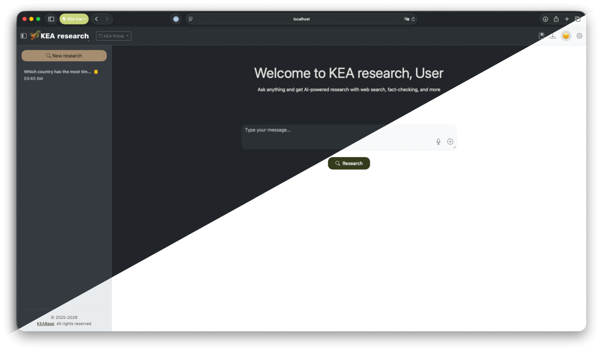
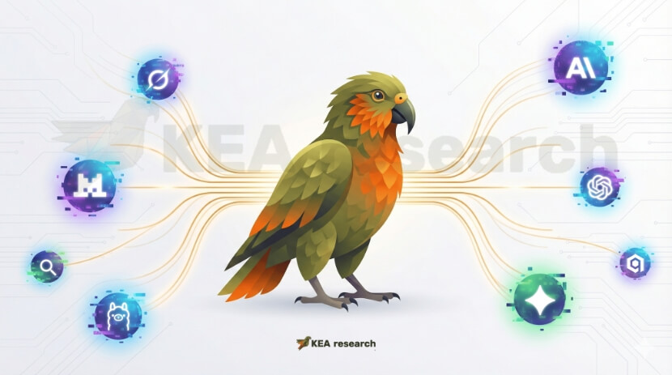

<p align="center">
  
</p>

<h3 align="center">5 AIs. 4 Steps. 1 Answer You Can Trust.</h3>

<p align="center">
  Multi-AI collaboration platform that combines responses from multiple AI models,<br>
  cross-validates information, and delivers verified, consensus-backed answers.
</p>

---

## The Challenge

When you ask a question to different AI models, you often get different answers — each presented with equal confidence. There is no built-in mechanism to determine which response is most accurate or to identify potentially incorrect information.

KEA Research addresses this by orchestrating multiple AI models to work together, evaluate each other's responses, and surface only the information that achieves consensus.

---

## See It In Action

<p align="center">
  
</p>

---

## Installation & Update

> Requires Docker: [Docker Desktop](https://www.docker.com/products/docker-desktop/) (Mac/Windows) or [Docker Engine](https://docs.docker.com/engine/install/) (Linux)

Same command installs or updates — it detects existing installation automatically.

<details open>
<summary><strong>Linux / Mac</strong></summary>

```bash
curl -fsSL research.kea.sh | sh
```

</details>

<details>
<summary><strong>Windows (PowerShell)</strong></summary>

```powershell
irm research.kea.sh | iex
```

</details>

<details>
<summary><strong>Manual Install</strong></summary>

```bash
git clone https://github.com/keabase/kea-research.git
cd kea-research
cp .env.example .env
# Edit .env with your API keys
docker compose up -d
```

</details>

<details>
<summary><strong>Manual Update</strong></summary>

```bash
cd kea-research && git pull && docker compose up -d --build
```

</details>

---

## How It Works

KEA processes every question through a structured 4-step pipeline:

| Step | Process | Purpose |
|------|---------|---------|
| **1. Initial** | Each AI answers independently | Gather diverse perspectives without bias |
| **2. Refine** | AIs see anonymized peer responses | Synthesize best ideas, improve answers |
| **3. Evaluate** | AIs rank and review each other | Identify consensus facts and flag disputed claims |
| **4. Synthesize** | Best-ranked AI creates final answer | Deliver verified, trustworthy response |

---

## Key Features

### Visual Intelligence
- Add images directly to chat context
- Models can analyze screenshots, diagrams, and photos

### Multi-AI Consensus
- Combines responses from 5 AI providers(Can be more than 5, up to you)
- Supports OpenAI, Anthropic, Google, Mistral, xAI, and Ollama
- Each model contributes independent analysis

### Fact Verification
- Automatic extraction of atomic facts from each response
- Cross-validation identifies points of agreement
- Disputed or unsupported claims are flagged and excluded

### Transparency
- Full visibility into each step of the process
- See how each AI responded and evolved its answer
- Understand why specific information was included or excluded

### Flexible Export
- Export complete research with all steps
- Multiple formats: Markdown, HTML, JSON, Plain Text
- Include or exclude metadata and timestamps

### Customization
<details>
<summary>75 languages supported (click to expand)</summary>

| | | | |
|---|---|---|---|
| 🇦🇿 Azərbaycan | 🇮🇩 Bahasa Indonesia | 🇲🇾 Bahasa Melayu | 🇮🇩 Basa Jawa |
| 🇧🇦 Bosanski | 🇦🇩 Català | 🏴󠁧󠁢󠁷󠁬󠁳󠁿 Cymraeg | 🇨🇿 Čeština |
| 🇩🇰 Dansk | 🇩🇪 Deutsch | 🇪🇪 Eesti | 🇺🇸 English (US) |
| 🇦🇺 English (AU) | 🇬🇧 English (UK) | 🇮🇪 English (IE) | 🇪🇸 Español |
| 🇪🇸 Euskara | 🇵🇭 Filipino | 🇫🇷 Français | 🇮🇪 Gaeilge |
| 🇪🇸 Galego | 🏴󠁧󠁢󠁳󠁣󠁴󠁿 Gàidhlig | 🇳🇬 Hausa | 🇭🇷 Hrvatski |
| 🇮🇸 Íslenska | 🇮🇹 Italiano | 🇰🇪 Kiswahili | 🇱🇻 Latviešu |
| 🇱🇺 Lëtzebuergesch | 🇱🇹 Lietuvių | 🇭🇺 Magyar | 🇲🇹 Malti |
| 🇳🇱 Nederlands | 🇳🇴 Norsk | 🇵🇱 Polski | 🇵🇹 Português |
| 🇧🇷 Português (Brasil) | 🇷🇴 Română | 🇦🇱 Shqip | 🇸🇰 Slovenčina |
| 🇸🇮 Slovenščina | 🇫🇮 Suomi | 🇸🇪 Svenska | 🇻🇳 Tiếng Việt |
| 🇹🇷 Türkçe | 🇳🇬 Yoruba | 🇬🇷 Ελληνικά | 🇧🇾 Беларуская |
| 🇧🇬 Български | 🇰🇿 Қазақша | 🇲🇰 Македонски | 🇷🇸 Српски |
| 🇺🇦 Українська | 🇬🇪 ქართული | 🇦🇲 Հայերdelays | 🇮🇱 עברית |
| 🇸🇦 العربية | 🇮🇷 فارسی | 🇵🇰 اردو | 🇪🇹 አማርኛ |
| 🇧🇩 বাংলা | 🇮🇳 ગુજરાતી | 🇮🇳 हिन्दी | 🇮🇳 ਪੰਜਾਬੀ |
| 🇮🇳 ಕನ್ನಡ | 🇮🇳 मराठी | 🇮🇳 தமிழ் | 🇮🇳 తెలుగు |
| 🇲🇲 မြန်မာစာ | 🇹🇭 ไทย | 🇨🇳 中文 (简体) | 🇹🇼 中文 (繁體) |
| 🇭🇰 中文 (香港) | 🇯🇵 日本語 | 🇰🇷 한국어 | |

</details>

- Light and dark themes
- Custom avatars and chat backgrounds
- Text-to-speech capability

### Administration
- Web-based admin panel
- Manage AI provider API keys
- User account management
- System configuration

---

## Supported AI Providers

<p align="center">
  
</p>

**OpenAI** · **Anthropic** · **Google** · **Mistral** · **xAI** · **OpenRouter** · **OpenAI-compatible** (Ollama, LM Studio, etc.)

---

## Use Cases

**Research & Analysis**
- Literature reviews requiring multiple perspectives
- Fact-checking and verification tasks
- Complex questions with nuanced answers

**Professional Decision Support**
- Business strategy analysis
- Technical architecture decisions
- Risk assessment and evaluation

**Education**
- Understanding where AI models agree and disagree
- Learning critical evaluation of AI-generated content
- Exploring topics from multiple angles

---

## The Name

The **Kea** is a parrot native to New Zealand, recognized as one of the most intelligent bird species. Known for problem-solving abilities, tool use, and collaborative behavior — qualities that inspired this platform's approach to AI orchestration.


---

<p align="center">
  <sub>KEA Research — Verified answers through AI collaboration</sub>
</p>